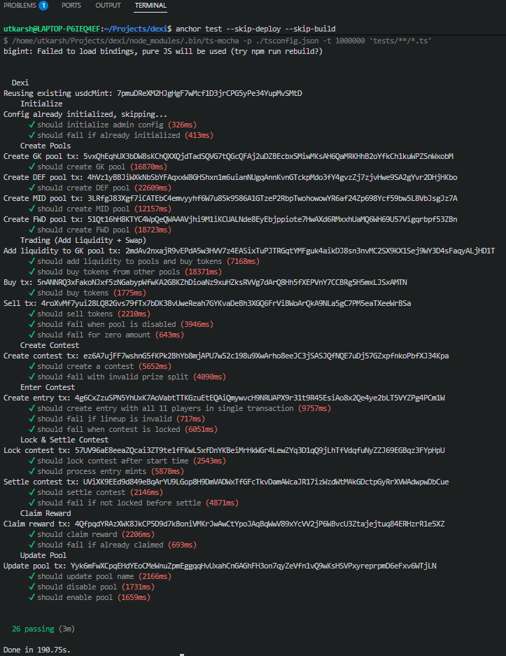

# Dexi — Decentralized Fantasy Sports on Solana

Dexi is a decentralized fantasy sports protocol built on Solana using the Anchor framework. Users trade athlete tokens on constant-product AMMs, draft lineups, and win USDC prizes.

**Devnet Program ID:** `5RjcrhEhspU8YLLjWN7SJ3TRJkoLZW3LnkrCWCNgTDb3`

## Features

- **Athlete Token Markets** — Buy/sell athlete tokens via CPMM bonding curves
- **Fantasy Contests** — Draft 11-athlete lineups with role-based constraints (GK, DEF, MID, FWD)
- **Prize Pool Mechanics** — 90% of staked entry tokens swapped to USDC for prizes, 10% burned
- **Keeper Automation** — Off-chain bot manages contest lifecycle (lock, process mints, settle)
- **Address Lookup Tables** — V0 versioned transactions for compressed contest entry

## Architecture

```
┌──────────────┐     ┌──────────────┐     ┌─────────────────┐
│   Frontend   │     │  Keeper Bot  │     │  Solana Program │
│  (Next.js)   │     │  (keepers/)  │     │  (programs/)    │
│              │     │              │     │                 │
│ Buy/Sell     │     │ Lock Contest │     │ 11 instructions │
│ Enter Contest│────▶│ Process Mints│────▶│ CPMM + Contest  │
│ Claim Reward │     │ Settle       │     │ Lifecycle       │
└──────────────┘     └──────────────┘     └─────────────────┘
```

| Component | Location | Tech |
|-----------|----------|------|
| Solana Program | `programs/dexi/` | Anchor 1.0.2, Rust |
| Frontend | `app/` | Next.js 16, React 19, Tailwind v4 |
| SDK | `packages/dexi-sdk/` | Codama-generated from IDL |
| Keeper Bot | `keepers/` | TypeScript, `@coral-xyz/anchor` |
| Tests | `tests/dexi.ts` | Mocha, ts-mocha, chai |

## Program Accounts

| Account | PDA Seed | Purpose |
|---------|----------|---------|
| `AdminConfig` | `"admin"` | Global config (admin, keeper, USDC mint, fee, treasury) |
| `AthletePool` | `"pool"` + mint | Per-athlete CPMM pool with role, name, enabled flag |
| `Contest` | `"contest"` + id (u64 LE) | Tournament state with prize split, escrow, ALT |
| `UserEntry` | `"entry"` + contest + user | User's 11-athlete lineup and claim status |

## Instructions

| Instruction | Caller | Description |
|-------------|--------|-------------|
| `initialize` | Admin | Create global admin config |
| `create_pool` | Admin | Init athlete pool + vaults |
| `update_pool` | Admin | Rename/disable/enable pool |
| `buy` | User | USDC → athlete tokens (CPMM) |
| `sell` | User | Athlete tokens → USDC (CPMM) |
| `create_contest` | Admin | Create contest with prize split, vaults, ALT |
| `enter_contest` | User | Validate lineup, stake 11 tokens (single tx) |
| `lock_contest` | Keeper | Open → Locked at start_time |
| `process_entry_mint` | Keeper | Swap 90% → USDC, burn 10% per mint |
| `settle_contest` | Keeper | Locked → Settled, snapshot prize pool |
| `claim_reward` | User + Keeper | Claim USDC prize (co-signed) |

## Getting Started

### Prerequisites

- Rust 1.89.0 (`rust-toolchain.toml`)
- Solana CLI
- Anchor 1.0.2
- pnpm (workspace monorepo)


## Tests



The integration test suite (`tests/dexi.ts`) covers:
1. Initialize — admin config setup
2. Create Pools — parameterized pool creation (GK, DEF, MID, FWD)
3. Trading — buy, sell, disabled-pool guard, zero-amount guard
4. Create Contest — happy path + invalid prize split
5. Enter Contest — valid entry, invalid lineup, locked-contest guard
6. Lock & Settle — lock, process entry mints, settle, not-locked guard
7. Claim Reward — happy path + already-claimed guard
8. Update Pool — rename, disable, enable

## Documentation

| Doc | Description |
|-----|-------------|
| [docs/architecture.md](docs/architecture.md) | System architecture, program layout, account model |
| [docs/current-scope.md](docs/current-scope.md) | MVP scope — instructions, contest flow, constraints |
| [docs/future-scope.md](docs/future-scope.md) | Planned enhancements (merkle settlement, salary caps, LP program) |
| [docs/scoring.md](docs/scoring.md) | Football scoring rules and formulas |


